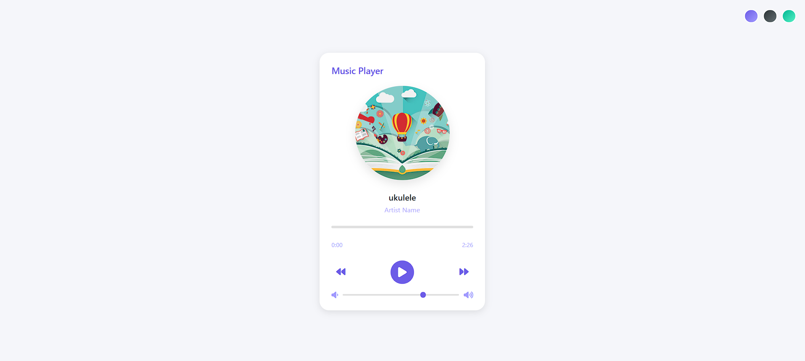

# Multi Themed Music Player - README



A sleek, modern music player with theme switching functionality built with HTML, CSS, and JavaScript.

## Features

🎵 **Music Playback**:
- Play/pause functionality
- Previous/next track navigation
- Progress bar with seek functionality
- Time display (current time and duration)

🎨 **Customizable Themes**:
- Three beautiful color themes (default, dark, and nature)
- Theme persistence using localStorage
- Easy-to-add new themes

🎛️ **Additional Controls**:
- Volume slider
- Smooth animations (album cover rotation)
- Responsive design

## Installation

1. Clone the repository:
   ```bash
   git clone https://github.com/your-username/music-player.git
   ```
2. Navigate to the project directory:
   ```bash
   cd music-player
   ```

## Project Structure

```
music-player/
├── index.html          # Main HTML file
├── music/              # Directory for music files
│   ├── hey.mp3
│   ├── summer.mp3
│   └── ukulele.mp3
├── images/             # Directory for album covers
│   ├── hey.jpg
│   ├── summer.jpg
│   └── ukulele.jpg
└── README.md           # This documentation file
```

## Usage

1. Add your music files to the `music/` directory
2. Add corresponding album art to the `images/` directory
3. Update the `songs` and `artists` arrays in the JavaScript to match your files:
   ```javascript
   const songs = ['hey', 'summer', 'ukulele'];
   const artists = ['Artist One', 'Artist Two', 'Artist Three'];
   ```
4. Open `index.html` in your browser

## Customization

### Adding New Themes

1. Add a new CSS class in the `<style>` section:
   ```css
   .ocean-theme {
     --primary-color: #0984e3;
     --secondary-color: #74b9ff;
     --text-color: #2d3436;
     --bg-color: #dfe6e9;
     --player-bg: #ffffff;
     --progress-color: #0984e3;
     --action-color: #0984e3;
   }
   ```
2. Add a theme button in the HTML:
   ```html
   <button class="theme-btn ocean" data-theme="ocean"></button>
   ```

### Changing Default Settings

- **Initial volume**: Modify the `value` attribute in the volume slider:
  ```html
  <input type="range" ... value="0.7" />
  ```
- **Initial theme**: Change the default theme in the JavaScript:
  ```javascript
  const savedTheme = localStorage.getItem('theme') || 'default';
  ```

## Dependencies

- [Font Awesome](https://fontawesome.com/) - For icons
- No other external dependencies required

## Browser Support

The music player works on all modern browsers including:
- Chrome
- Firefox
- Safari
- Edge

## Contributing

Contributions are welcome! Please follow these steps:

1. Fork the project
2. Create your feature branch (`git checkout -b feature/AmazingFeature`)
3. Commit your changes (`git commit -m 'Add some AmazingFeature'`)
4. Push to the branch (`git push origin feature/AmazingFeature`)
5. Open a Pull Request

## License

Distributed under the MIT License. See `LICENSE` for more information.

## Contact


Project Link: [https://github.com/spoidarman/Multi-Themed-Music-Player]([https://github.com/spoidarman/Multi-Themed-Music-Player])

## Open here
Project Link: [OPEN]([https://multitheme-musicplayer-moinak.netlify.app/])

## Screenshots

### Default Theme


### Dark Theme


### Nature Theme


---
